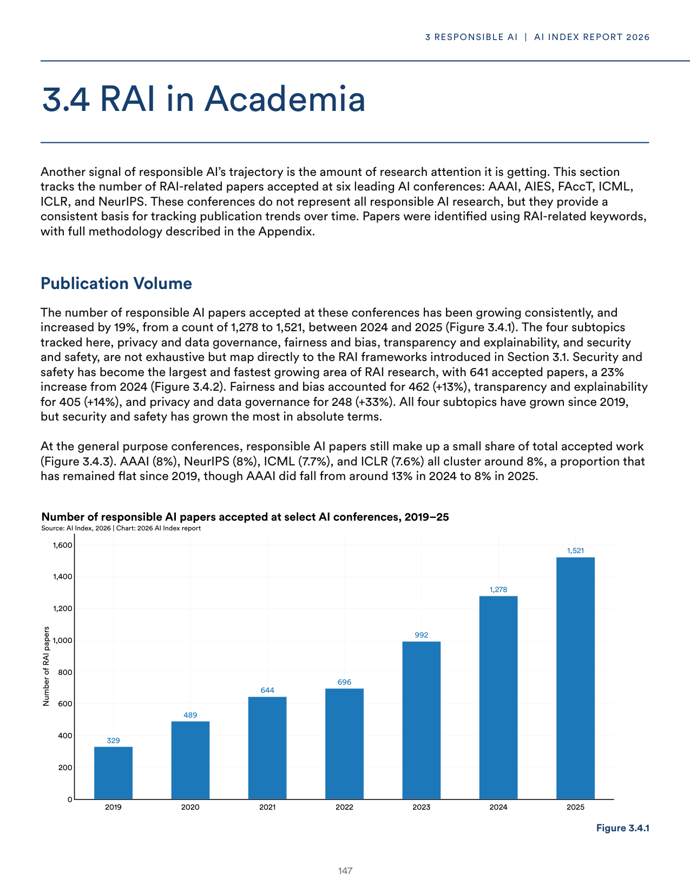
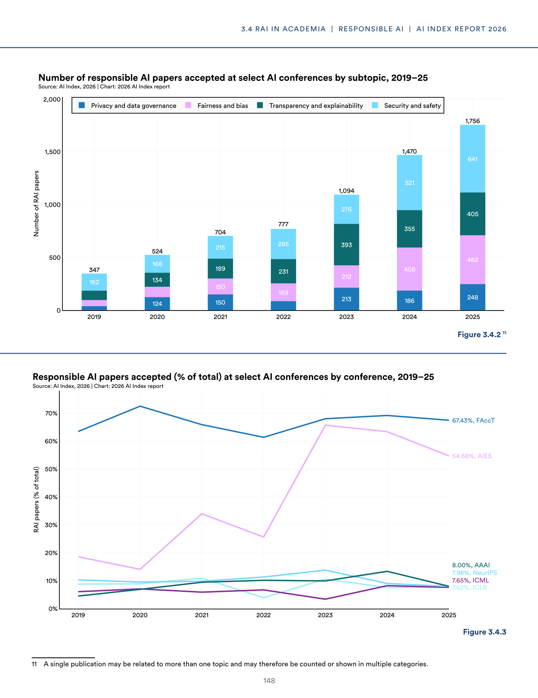
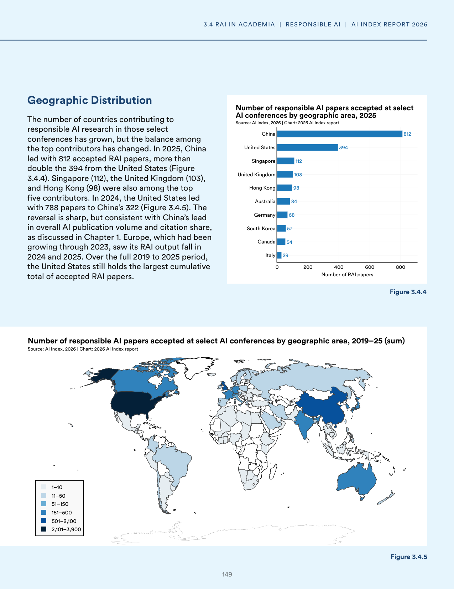
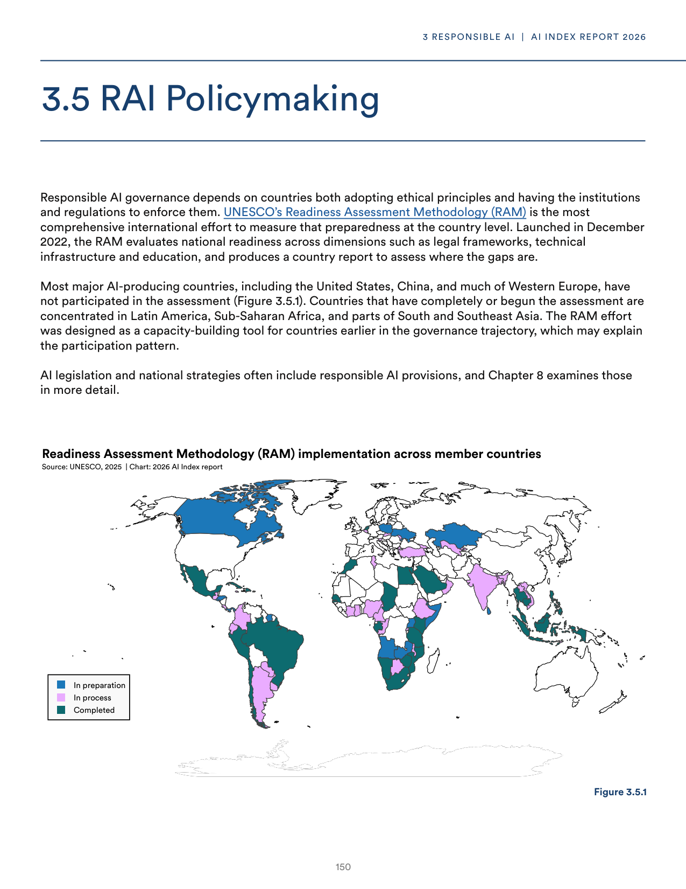
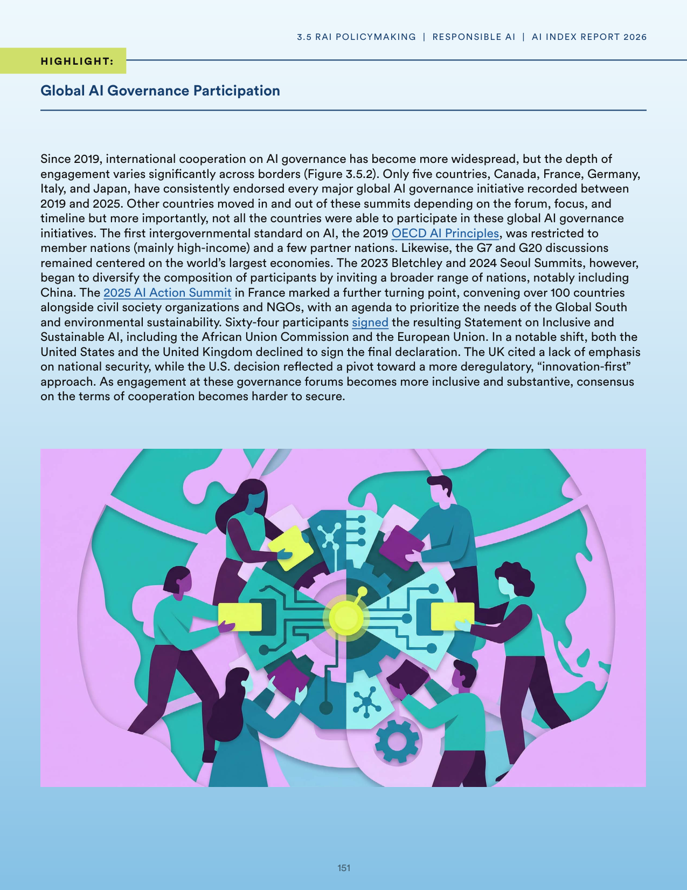
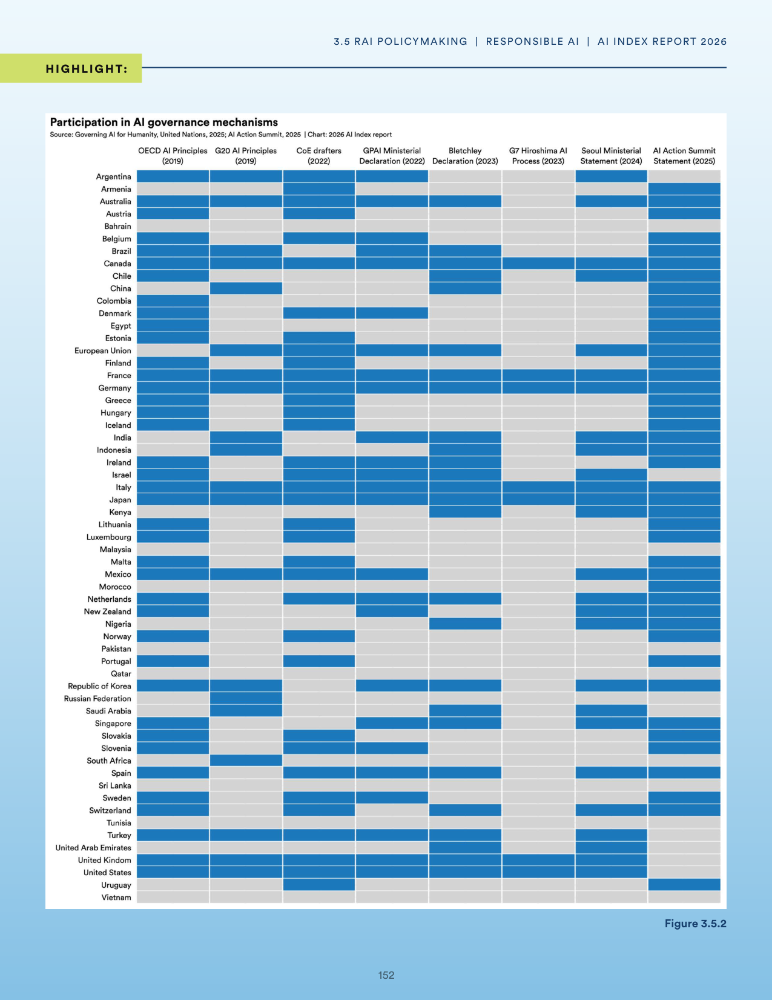
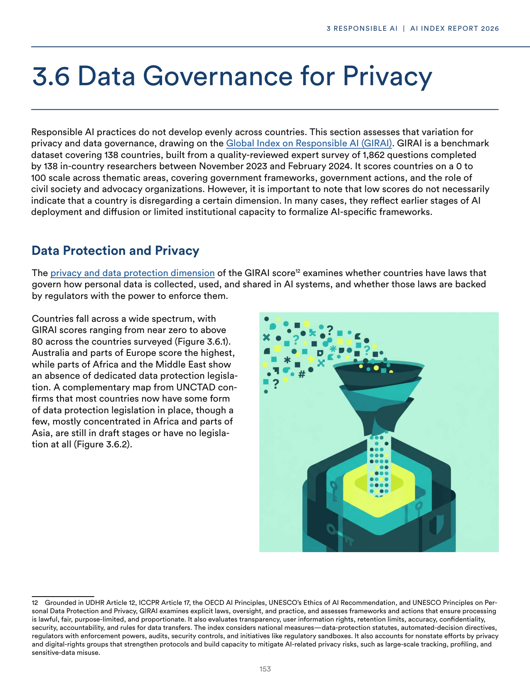
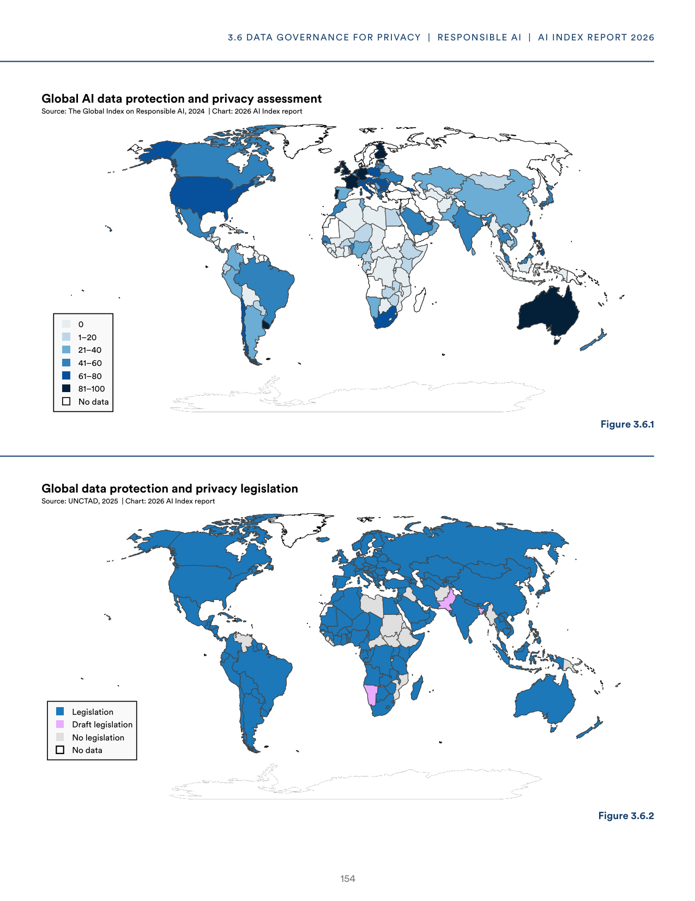
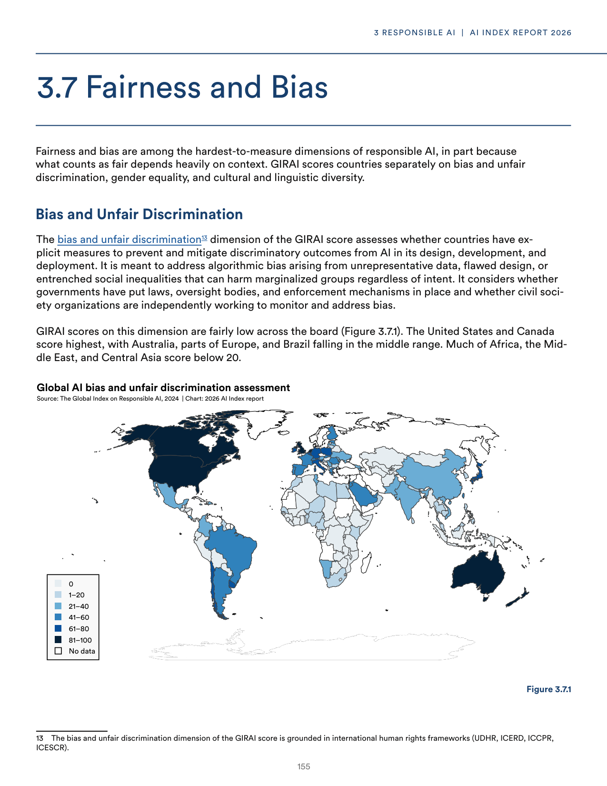
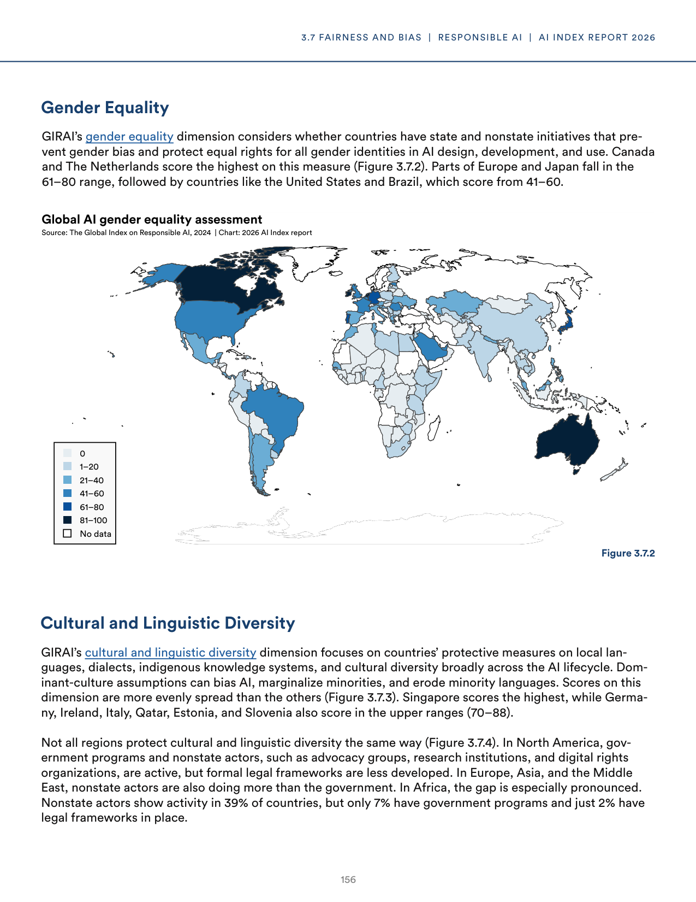

# responsible-ai-and-governance.json

**Parent:** [[content/L1/responsible-ai-governance-implementation-status|responsible-ai-governance-implementation-status]] — RAI maturity scores rose from 2.5 to 2.8, with 62% of organizations having frameworks, while 42% cite talent shortages and 38% struggle with fairness/safety metrics, amidst EU risk-based mandates and academic focus on algorithmic bias and training costs.

The provided text details the landscape of Responsible AI and governance, specifically focusing on academic and government efforts to manage AI risks. In terms of academic research, the documents highlight a trend toward 'Responsible AI' frameworks that emphasize fairness, transparency, and safety. Regarding governance, the text examines the roles of various international and national bodies in establishing standards for AI deployment. Specifically, it analyzes the tension between rapid innovation and the need for regulatory safeguards. A significant portion of the text is dedicated to the 'Responsible AI' trend in academia, noting that researchers are increasingly focusing on the societal impacts of AI, including algorithmic bias and the environmental cost of training large models. In the realm of governance, the text discusses the emergence of specific AI acts and guidelines (such as those in the EU) aimed at categorizing AI risks and mandating audits for high-risk systems. It further notes that while some countries favor a 'light-touch' approach to foster industry growth, others are moving toward mandatory compliance and certification processes to ensure public safety and trust.

## Source pages

