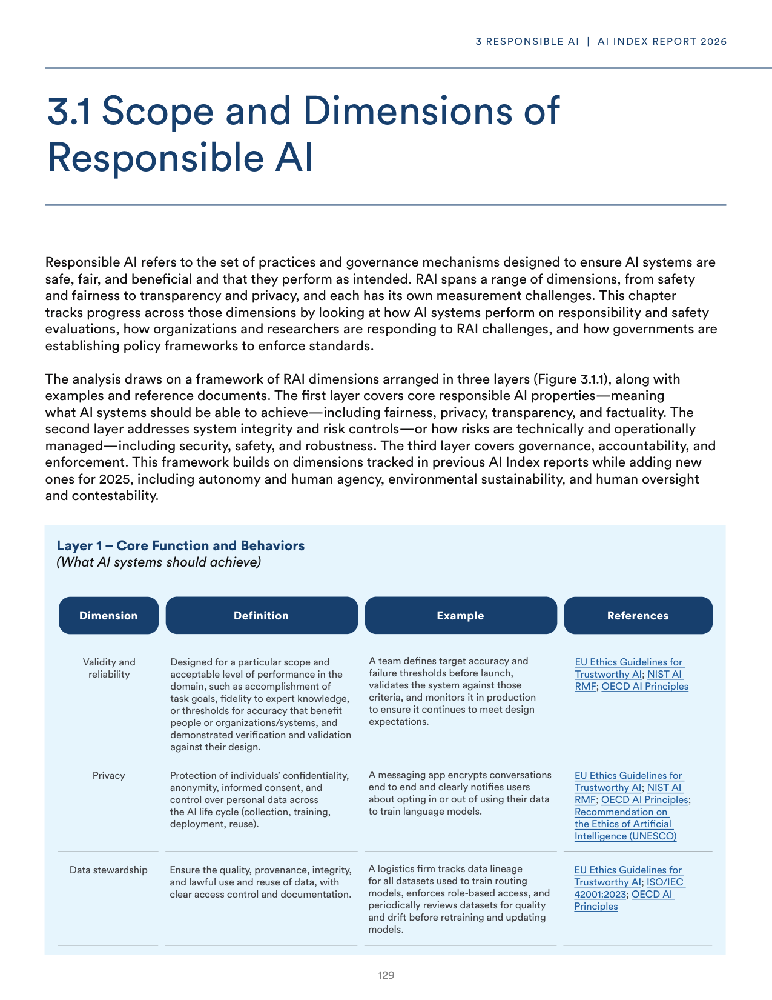
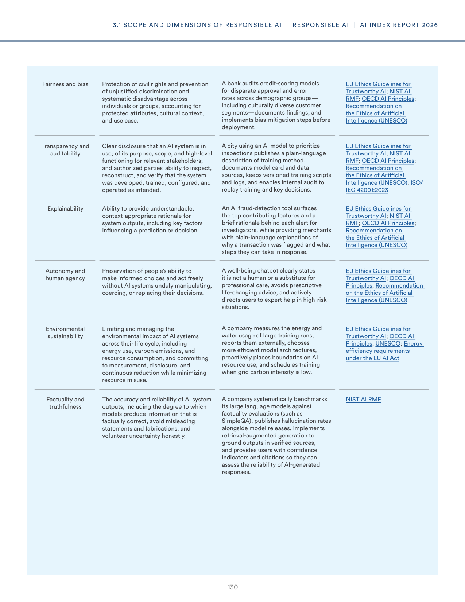
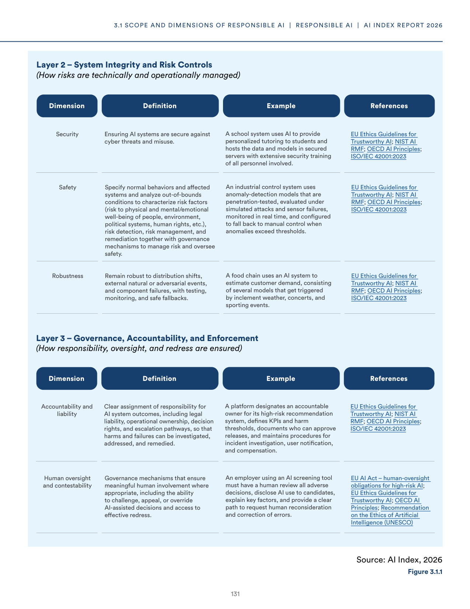
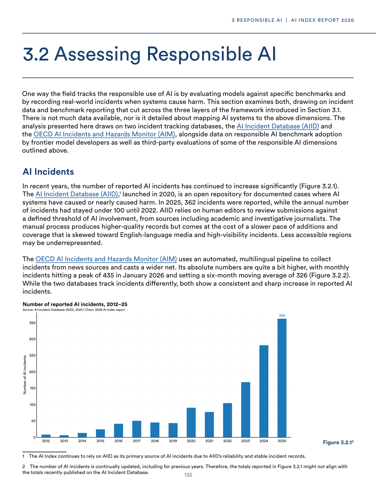
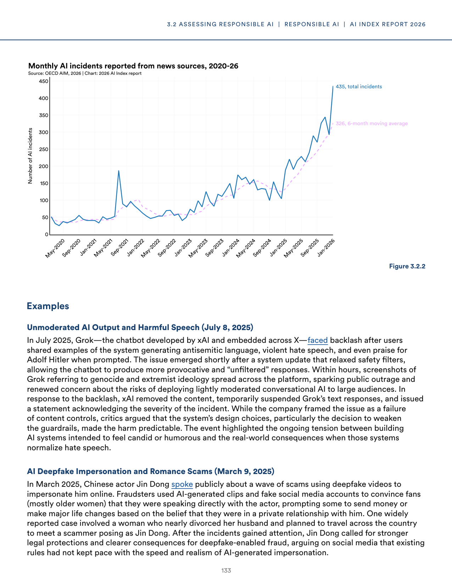
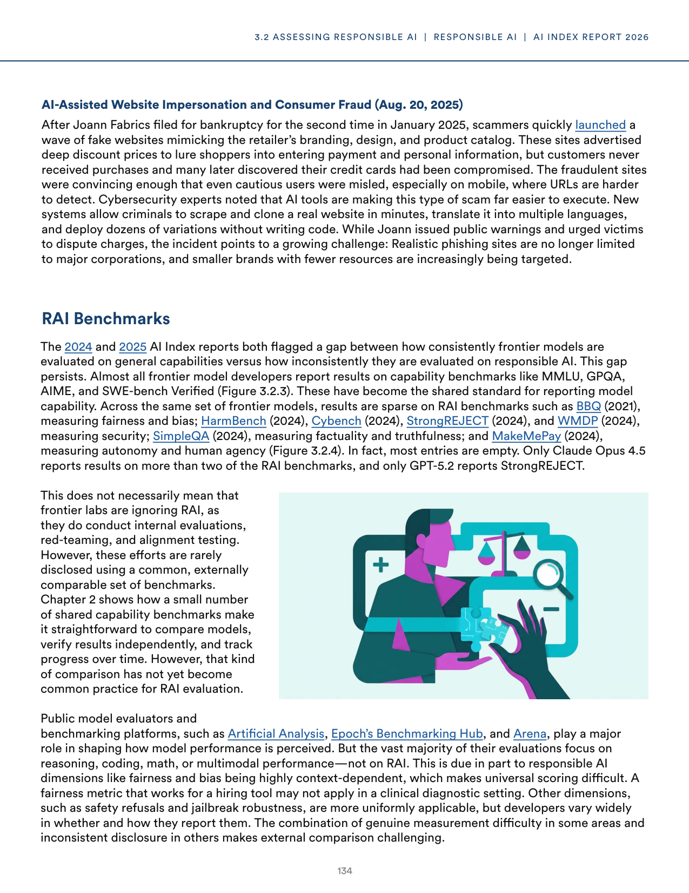

# responsible_ai_benchmarks_dimensions

**Parent:** [[content/L1/ai-governance-responsible-ai-framework-and-technical-errors|ai-governance-responsible-ai-framework-and-technical-errors]] — The context analyzes the gap between AI deployment and safety frameworks, detailing the Level 4 autonomy delays in Phoenix and San Francisco, the five dimensions of Responsible AI using benchmarks like AdvBench and TruthfulQA, and a Pydantic v2 'model_dump' AttributeError encountered by a user.

The provided text outlines the framework for Responsible AI, focusing on the monitoring and evaluation of AI systems through a set of established dimensions and benchmarks. Responsible AI is analyzed across several key dimensions: 

1. **Data & Privacy:** Ensuring data quality, provenance, and the protection of user privacy.
2. **Safety & Robustness:** Evaluating a model's resistance to adversarial attacks, its stability, and its ability to avoid generating harmful content.
3. **Fairness & Bias:** Testing for disparate impact and ensuring equitable performance across different demographic groups.
4. **Transparency & Explainability:** Assessing how well the model's decision-making process can be interpreted and documented.
5. **Human-AI Interaction:** Evaluating the efficacy and safety of the interface between the user and the AI.

To measure these dimensions, the text identifies several gold-standard benchmarks. For safety and robustness, it highlights 'AdvBench' and 'Do-Not-Answer' as key tools for testing harmfulness and refusal behavior. For fairness, it references the 'Bbenchmark' and 'ToxiGen' to identify social biases and toxicities. For explainability, it mentions 'TruthfulQA' to assess the factual accuracy and 'hallucinations' of models. The text emphasizes that while these benchmarks provide a baseline, the dynamic nature of LLMs requires continuous, red-teaming-based evaluation rather than static tests alone.

## Source pages

