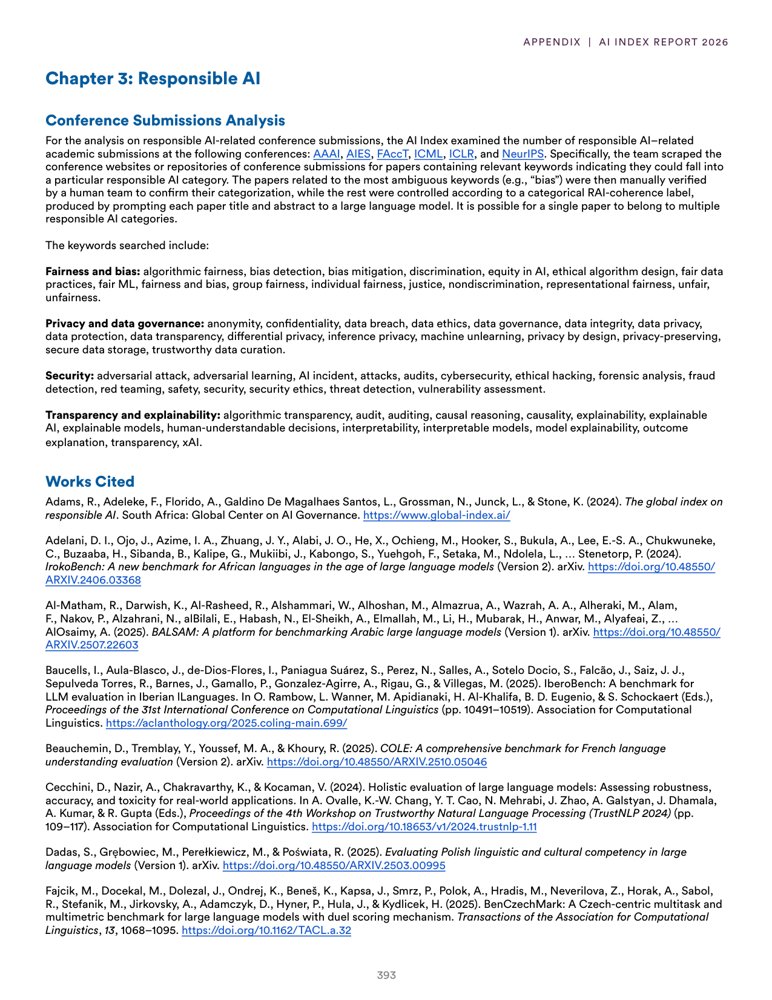
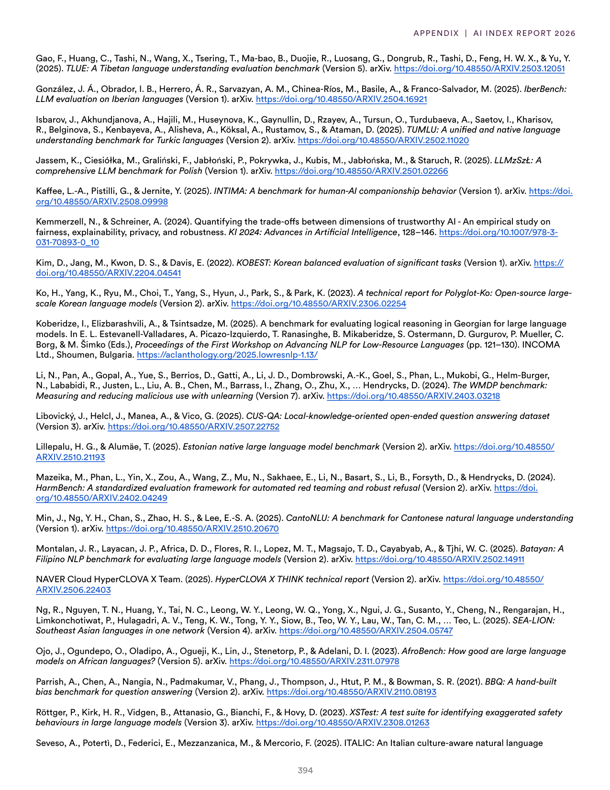
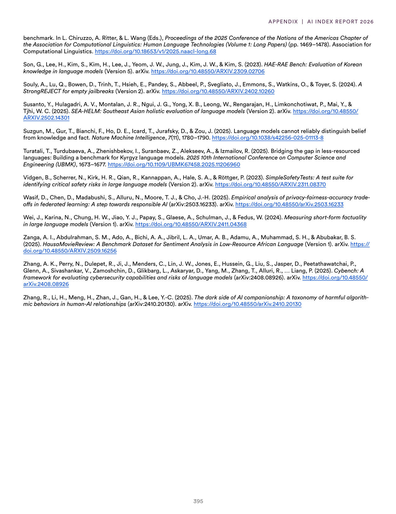

# responsible_ai_benchmarks_methodology

**Parent:** [[index]]

The provided text outlines the methodology and sources for analyzing Responsible AI and the current state of AI development. Specifically, it details how the researchers categorized and tracked Responsible AI trends by analyzing a curated set of papers and a set of 'Responsible AI' benchmarks. The analysis included a review of the literature and benchmarks to identify a set of 'Responsible AI' indicators. The text also provides an extensive bibliography of research papers and benchmarks used to evaluate model performance and safety across various dimensions, including fairness, robustness, and transparency. Key references include works on the 'Toxicity' of LLMs and benchmarks like 'TruthfulQA' and 'HELM' (Holistic Evaluation of Language Models).

## Source pages

