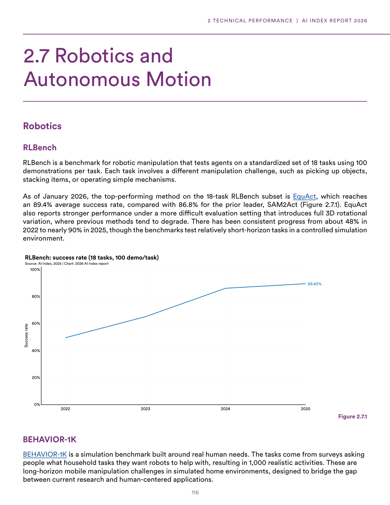
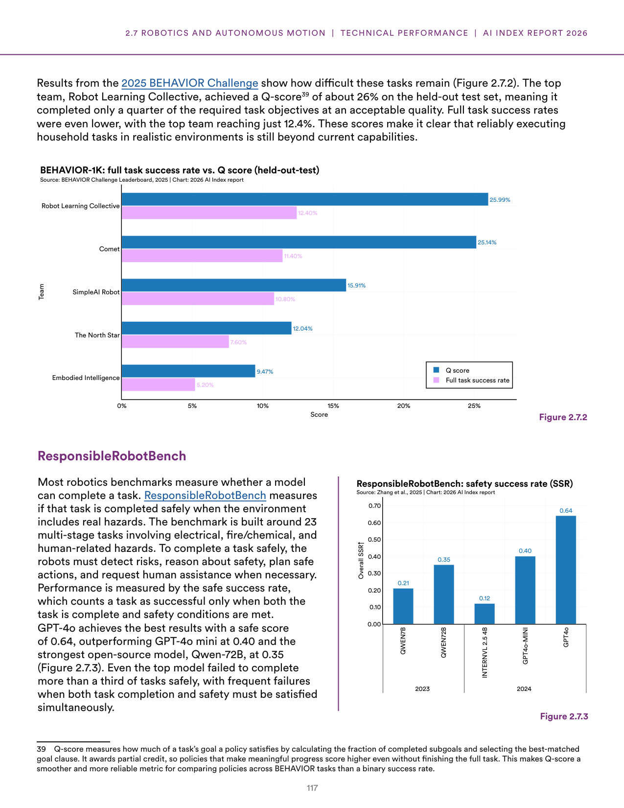
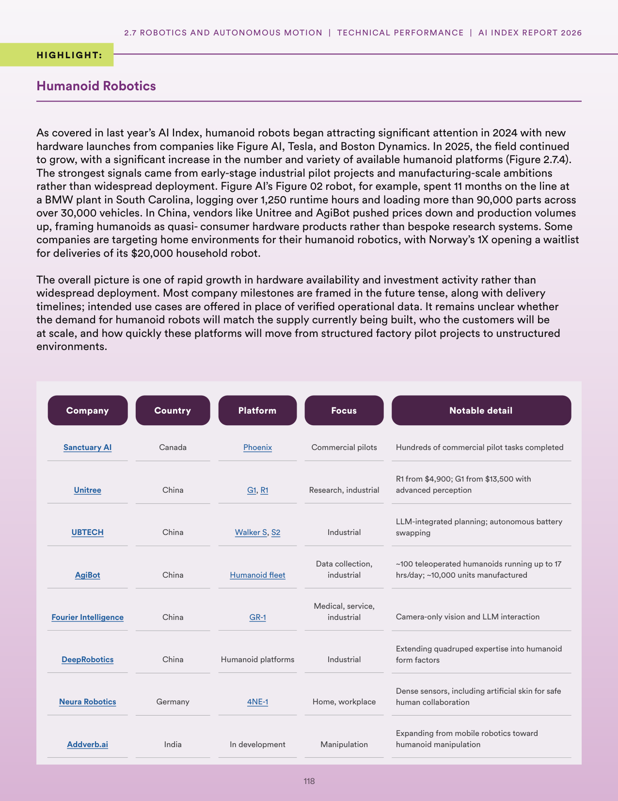
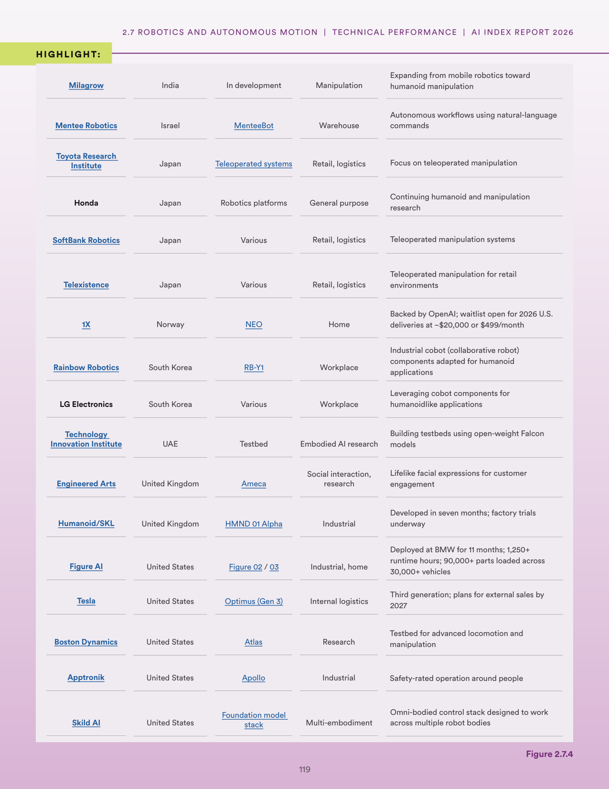
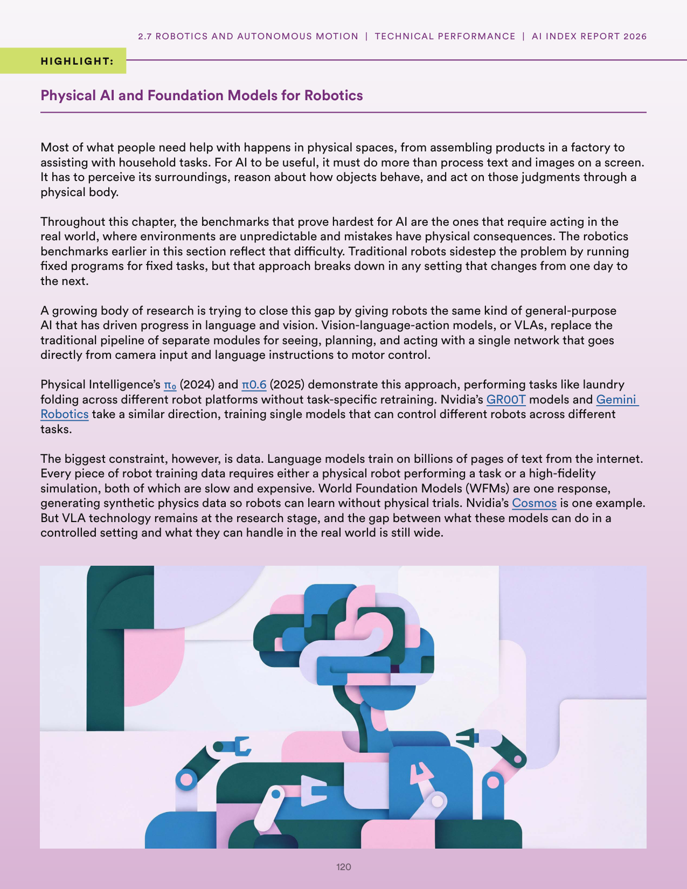

# robotics_sim_to_real_gap

**Parent:** [[content/L1/ai-specialized-benchmarks-and-robotics|ai-specialized-benchmarks-and-robotics]] — AI models show improvements in benchmarks like GSM8K, HumanEval, and RLBench, but struggle with complex multi-step reasoning and the 'sim-to-real' gap in robotics, while professional exam success in law and medicine does not equate to real-world practice.

The provided text discusses the state of robotics and AI-driven physical automation, contrasting simulated and real-world performance. In terms of benchmarks, the 'jaggedness' of robotics is evident in the gap between simulation and reality; for example, while the RLBench benchmark shows high success rates in simulated environments, these do not always translate to physical robots. In terms of specific benchmarks, RLBench is used to evaluate robot manipulation across various tasks. The text highlights a trend toward using Large Language Models (LLMs) and Vision-Language Models (VLMs) to improve robot reasoning and planning. A key challenge remains the 'sim-to-real' gap, where robots trained in simulation struggle with the noise and unpredictability of physical environments. To address this, researchers are utilizing techniques like domain randomization and scaling up training data. Furthermore, the integration of LLMs allows robots to decompose complex, high-level instructions into actionable sub-tasks, though precise execution and spatial awareness remain bottlenecks.

## Source pages

