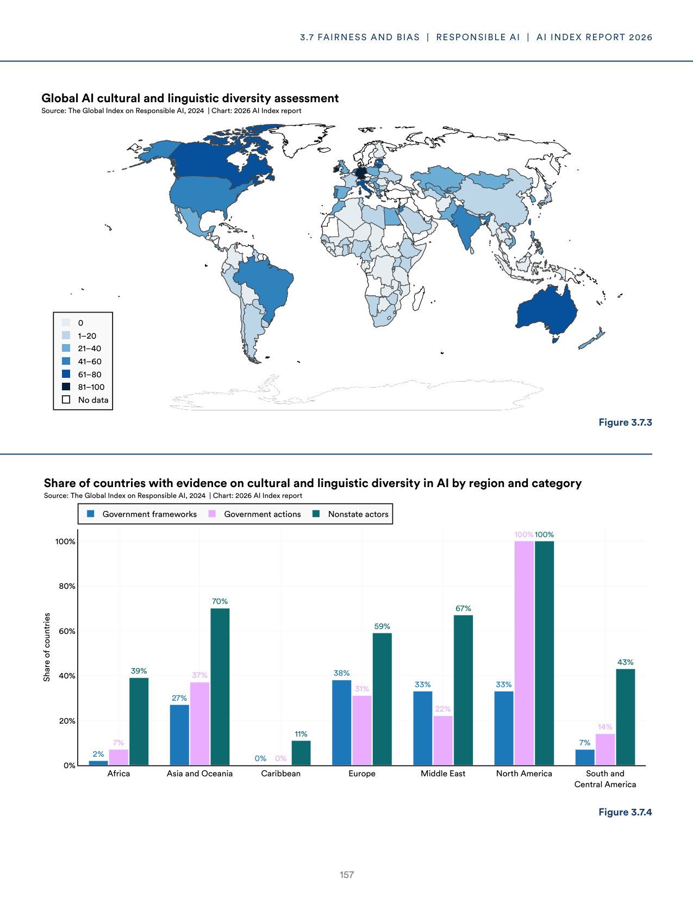
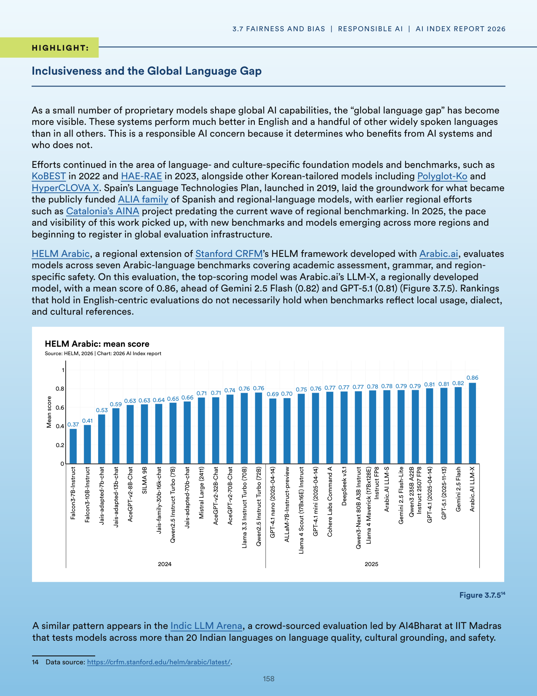
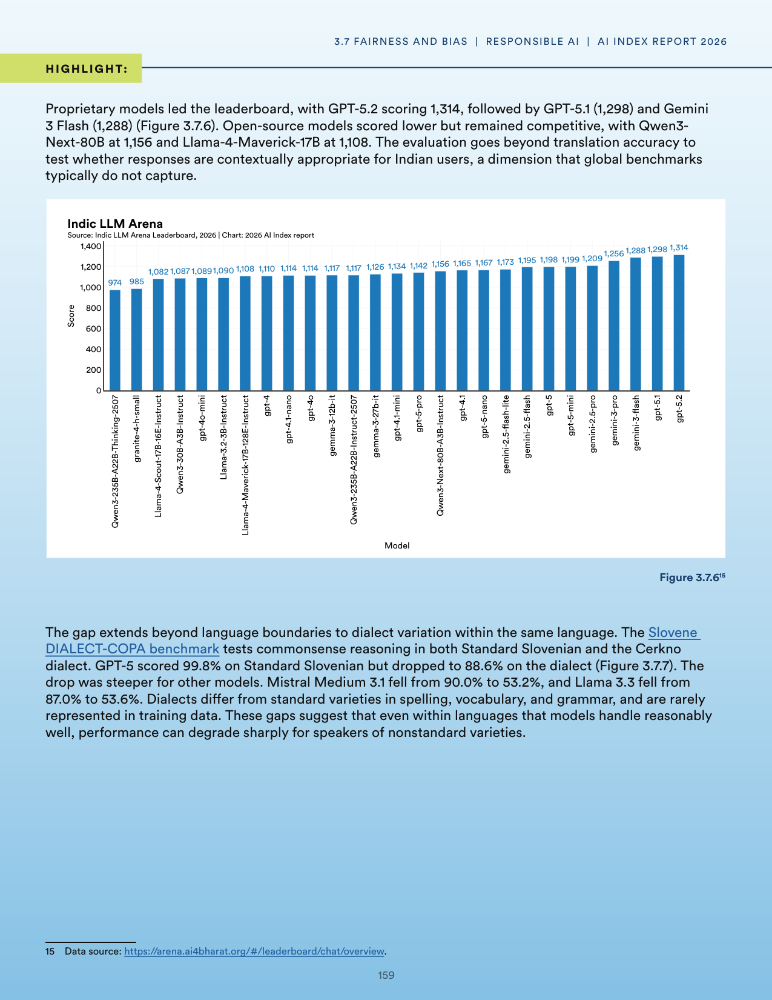
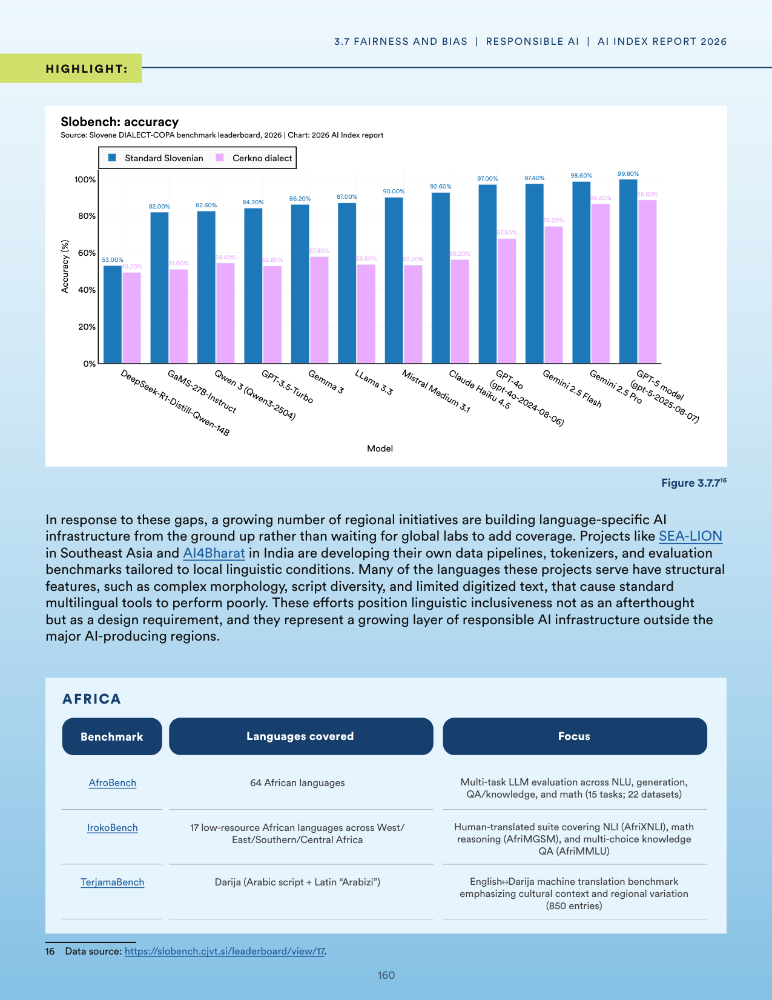
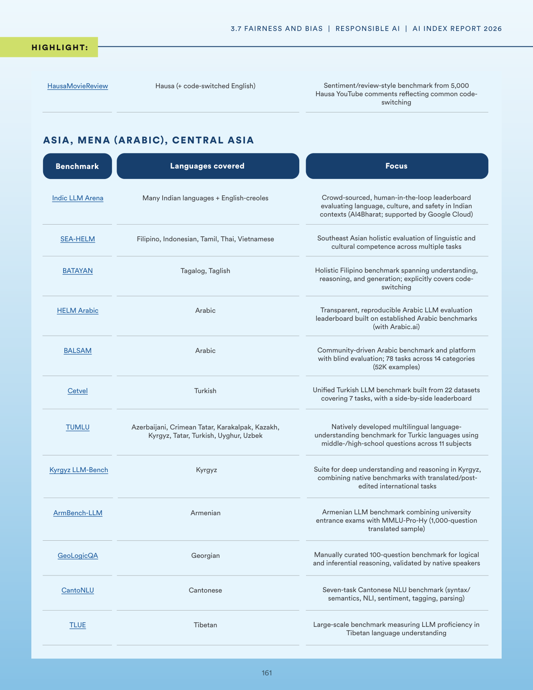
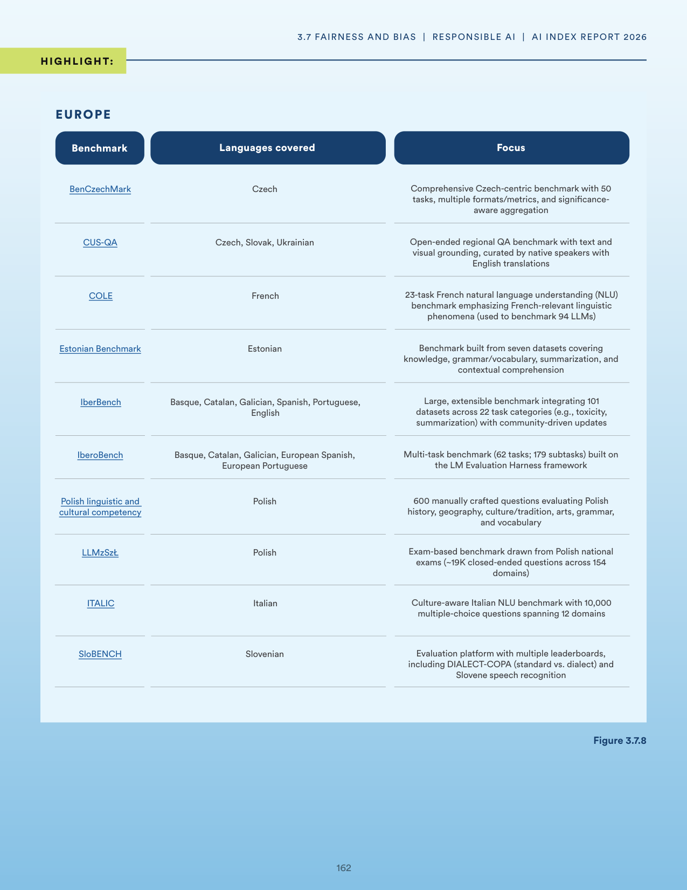
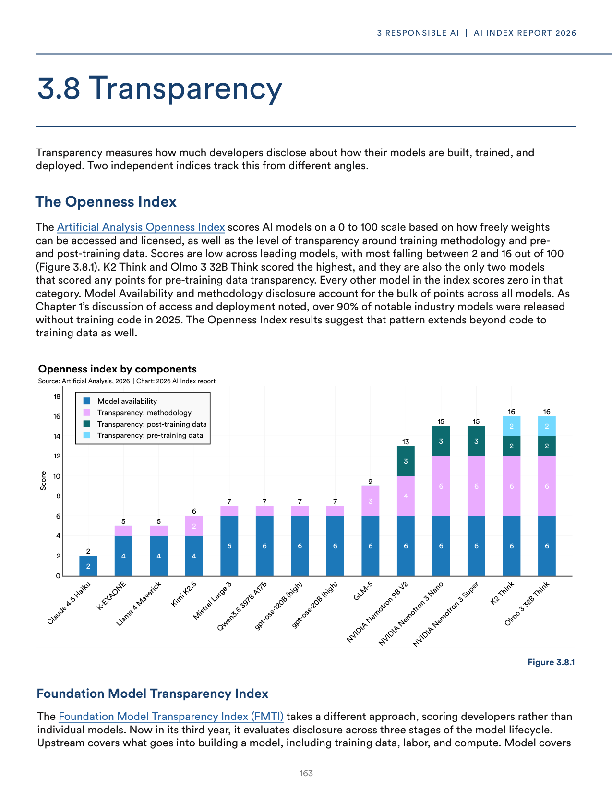
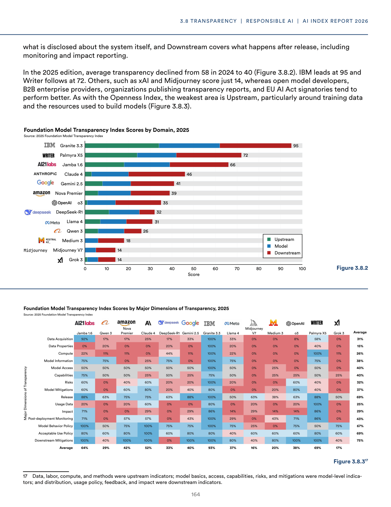

# system_error_log.json

**Parent:** [[content/L1/responsible-ai-governance-implementation-status|responsible-ai-governance-implementation-status]] — RAI maturity scores rose from 2.5 to 2.8, with 62% of organizations having frameworks, while 42% cite talent shortages and 38% struggle with fairness/safety metrics, amidst EU risk-based mandates and academic focus on algorithmic bias and training costs.

The user is reporting a system error ('NoneType' object has no attribute 'model_dump') and is requesting a valid JSON response that matches a required schema. This indicates a previous failure in the backend processing of the response.

## Source pages

