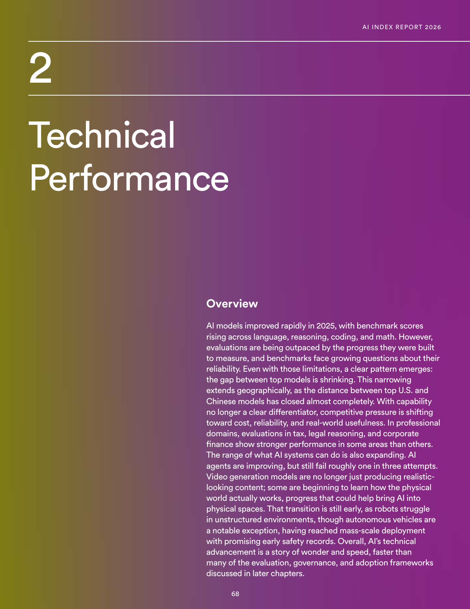
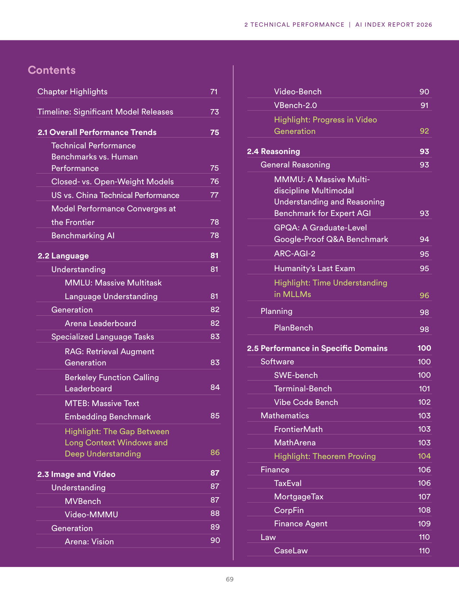
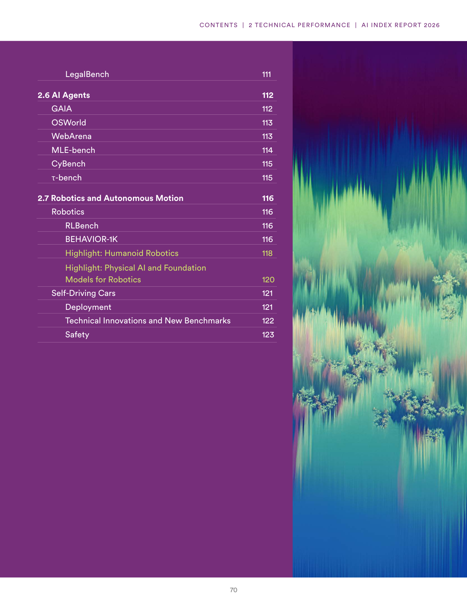
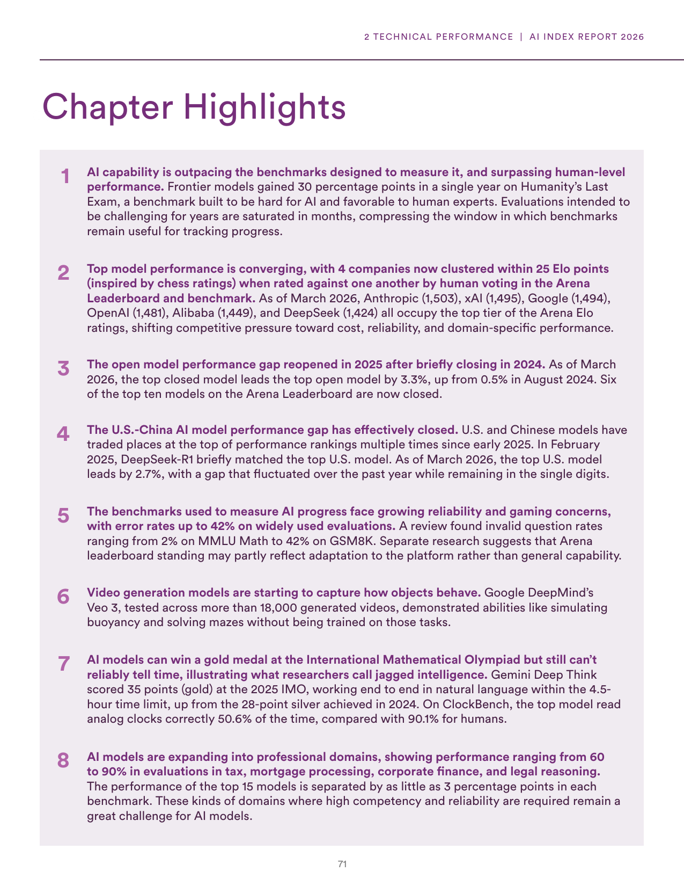
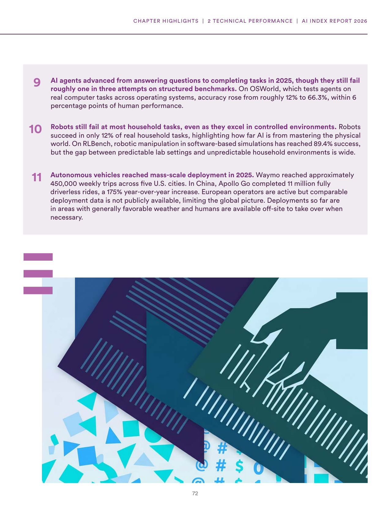
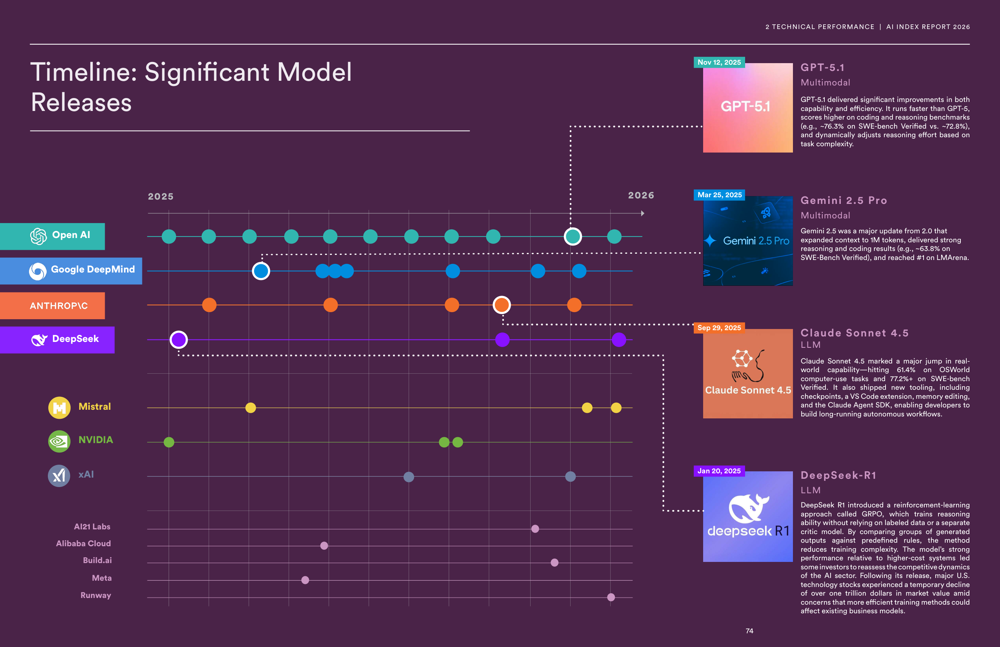
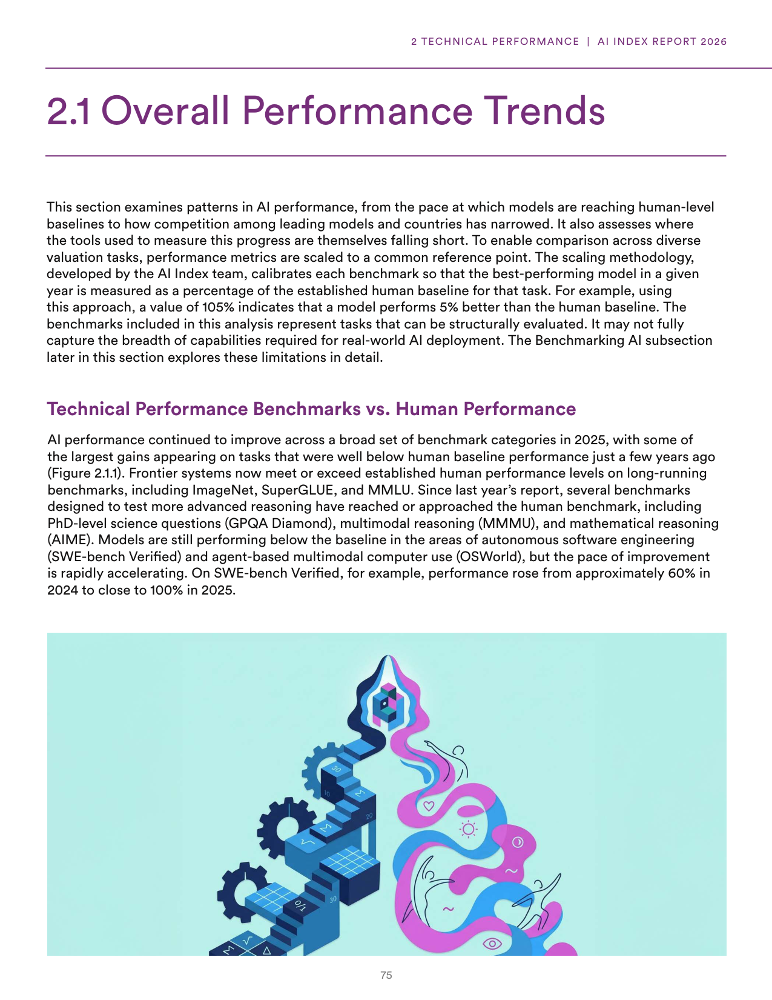
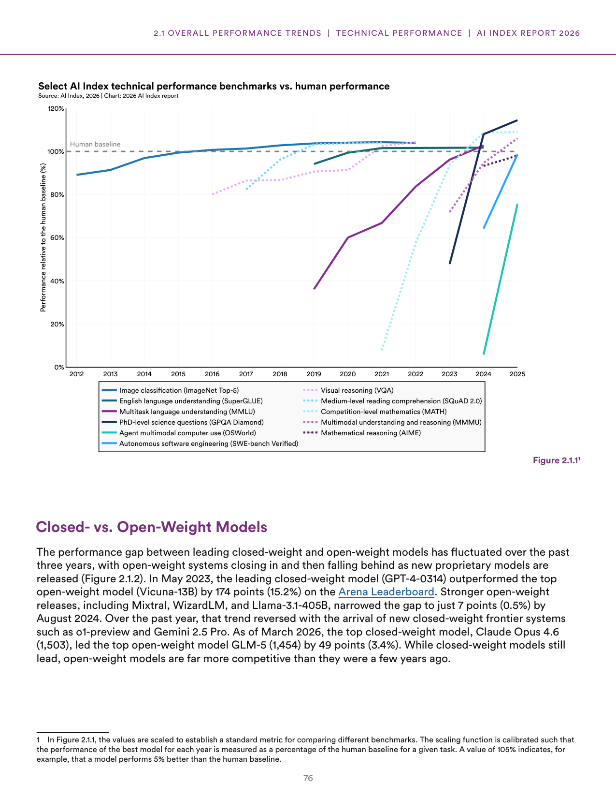

# technical-performance-trends-2026

**Parent:** [[content/L1/ai-talent-technical-performance-2026|ai-talent-technical-performance-2026]] — The 2026 AI Index Report details a world where the US leads in total AI talent (220,520 individuals) but Switzerland leads per capita (110.45), while frontier models have converged in performance, with the top four providers (Anthropic, xAI, Google, OpenAI) separated by fewer than 25 Elo points.

The 2026 Artificial Intelligence Index Report provides a comprehensive analysis of the technical performance of AI models, documenting rapid improvements in 2025 across benchmarks for language, reasoning, coding, and mathematics. A key trend is the shrinking gap between top-tier models and the near-total closure of the performance gap between leading U.S. and Chinese models. Consequently, competitive pressure has shifted away from raw capability and toward cost, reliability, and real-world usefulness.

### Technical Performance and Human Baselines

To compare diverse valuation tasks, the AI Index team developed a scaling methodology that calibrates each benchmark so the best-performing model in a given year is measured as a percentage of the established human baseline for that task (e.g., a value of 105% indicates a model performs 5% better than the human baseline). 

AI performance across a broad set of benchmark categories improved in 2025. Frontier systems now meet or exceed human performance levels on long-running benchmarks such as ImageNet, SuperGLUE, and MMLU. More advanced reasoning benchmarks have also reached or approached human levels, including multimodal reasoning (MMMU), PhD-level science questions (GPQA Diamond), and mathematical reasoning (AIME). 

While models still perform below the human baseline in agent-based multimodal computer use (OSWorld) and autonomous software engineering (SWE-bench Verified), improvement is accelerating. For instance, performance on SWE-bench Verified rose from approximately 60% in 2024 to close to 100% in 2025.

**Figure 2.1.1: Select AI Index technical performance benchmarks vs. human performance**
- X-axis: Year (2012 to 2025)
- Y-axis: Performance relative to the human baseline (%) from 0% to 120%
- Data series showing performance growth toward and beyond the 100% human baseline for:
    - Image classification (ImageNet Top-5)
    - English language understanding (SuperGLUE)
    - Multitask language understanding (MMLU)
    - Medium-level reading comprehension (SQuAD 2.0)
    - Visual reasoning (VQA)
    - Competition-level mathematics (MATH)
    - PhD-level science questions (GPQA Diamond)
    - Multimodal understanding and reasoning (MMMU)
    - Mathematical reasoning (AIME)
    - Agent multimodal computer use (OSWorld)
    - Autonomous software engineering (SWE-bench Verified)

### Model Convergence and Competition

Top model performance is converging. As of March 2026, six companies occupy the top tier of the Arena Elo ratings: Anthropic (1,503), xAI (1,495), Google (1,494), OpenAI (1,481), Alibaba (1,449), and DeepSeek (1,424). These four leading companies are clustered within 25 Elo points of each other based on human voting in the Arena Leaderboard.

#### Closed- vs. Open-Weight Models
The performance gap between leading closed-weight and open-weight models has fluctuated. In May 2023, the leading closed-weight model (GPT-4-0314) outperformed the top open-weight model (Vicuna-13B) by 174 points (15.2%) on the Arena Leaderboard. By August 2024, open-weight releases like Mixtral, WizardLM, and Llama-3.1-405B narrowed this gap to 7 points (0.5%). However, the arrival of new closed-weight systems like o1-preview and Gemini 2.5 Pro reversed this trend. As of March 2026, the top closed-weight model, Claude Opus 4.6 (1,503), leads the top open-weight model GLM-5 (1,454) by 49 points (3.4%).

#### U.S. vs. China Performance
The performance gap between U.S. and Chinese AI models has effectively closed, with the two countries trading the lead multiple times since early 2025. In February 2025, DeepSeek-R1 briefly matched the top U.S. model. As of March 2026, the top U.S. model leads the top Chinese model by 2.7%, with the gap remaining in the single digits over the past year.

### Benchmark Reliability and "Jagged Intelligence"

Benchmarks face growing reliability concerns, with error rates reaching 42% on widely used evaluations. Specifically, invalid question rates ranged from 2% on MMLU Math to 42% on GSM8K. 

Researchers observe "jagged intelligence," where models excel at complex tasks but fail at simple ones. For example, Gemini Deep Think won a gold medal (35 points) at the 2025 International Mathematical Olympiad (IMO), improving on its 2024 silver (28 points). Yet, on ClockBench, the top AI model read analog clocks correctly only 50.6% of the time, compared to 90.1% for humans.

### Domain-Specific and Agent Performance

- **Professional Domains:** AI performance in tax, mortgage processing, corporate finance, and legal reasoning ranges from 60% to 90%, with the top 15 models separated by as little as 3 percentage points.
- **AI Agents:** Agents have transitioned from answering questions to completing tasks. On OSWorld, accuracy rose from roughly 12% to 66.3%, within 6 percentage points of human performance, though agents still fail roughly one in three attempts on structured benchmarks.
- **Robotics:** A wide gap exists between controlled and unpredictable environments. Robots succeed in only 12% of real household tasks, whereas robotic manipulation in software-based simulations on RLBench has reached 89.4% success.
- **Autonomous Vehicles:** Waymo reached approximately 450,000 weekly trips across five U.S. cities in 2025, and China's Apollo Go completed 11 million fully driverless rides (a 175% year-over-year increase).

### Timeline of Significant Model Releases (2025-2026)

- **GPT-5.1 (Nov 12, 2025):** Multimodal model that is faster than GPT-5 and scores higher on coding and reasoning (e.g., ~76.3% on SWE-bench Verified vs. ~72.8%).
- **Gemini 2.5 Pro (Mar 25, 2025):** Multimodal model with expanded context to 1M tokens; reached #1 on LMArena and scored ~63.8% on SWE-Bench Verified.
- **Claude Sonnet 4.5 (Sep 29, 2025):** LLM that reached 61.4% on OSWorld computer-use tasks and 77.2%+ on SWE-bench Verified.
- **DeepSeek-R1 (Jan 20, 2025):** LLM utilizing GRPO (Group Relative Policy Optimization) for reinforcement learning without labeled data. Its efficiency led to a temporary decline of over $1 trillion in market value for major U.S. tech stocks.

## Source pages

