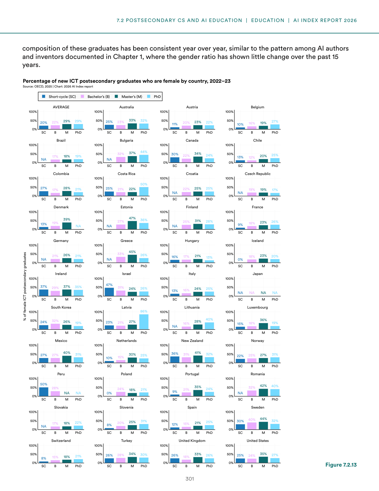
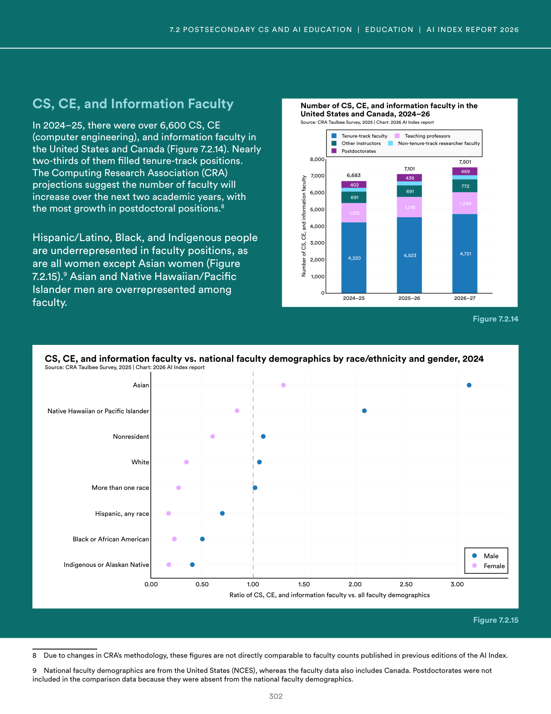
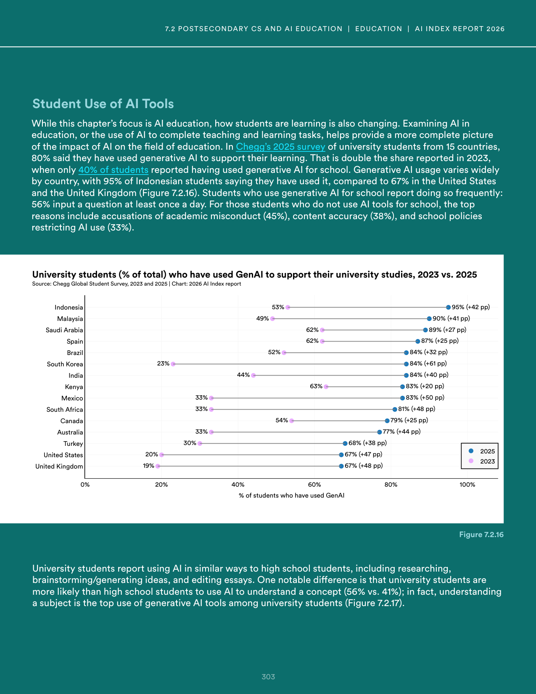
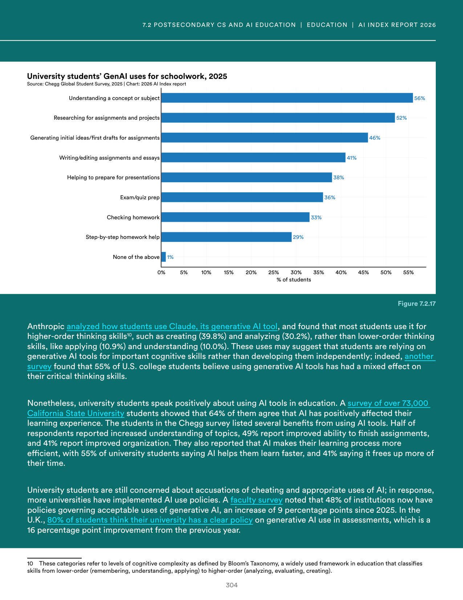

# technical_education_demographics_and_ai_integration

**Parent:** [[content/L1/ai-education-ethics-sovereignty-trends|ai-education-ethics-sovereignty-trends]] — The 2025 AI Index reports a global skills gap and a lack of standardized AI curricula, with France, UAE, and China investing billions in 'AI Sovereignty' to reduce NVIDIA and US-provider dependency. In the US, K-12 CS enrollment gaps persist in the U20 population due to teacher shortages, while universities shift from AI bans to guided integration.

The provided text details gender and diversity trends in technical education, as well as the integration of AI in higher education. In terms of demographics, the data highlights a disparity in gender representation across various technical fields. Regarding AI, the text outlines how universities are adapting to the prevalence of generative AI, with a focus on policy development, the shift toward AI-assisted learning, and the challenge of maintaining academic integrity. It specifically notes that university policies on AI are evolving from outright bans to guided integration, emphasizing the need for AI literacy among both students and faculty.

## Source pages

