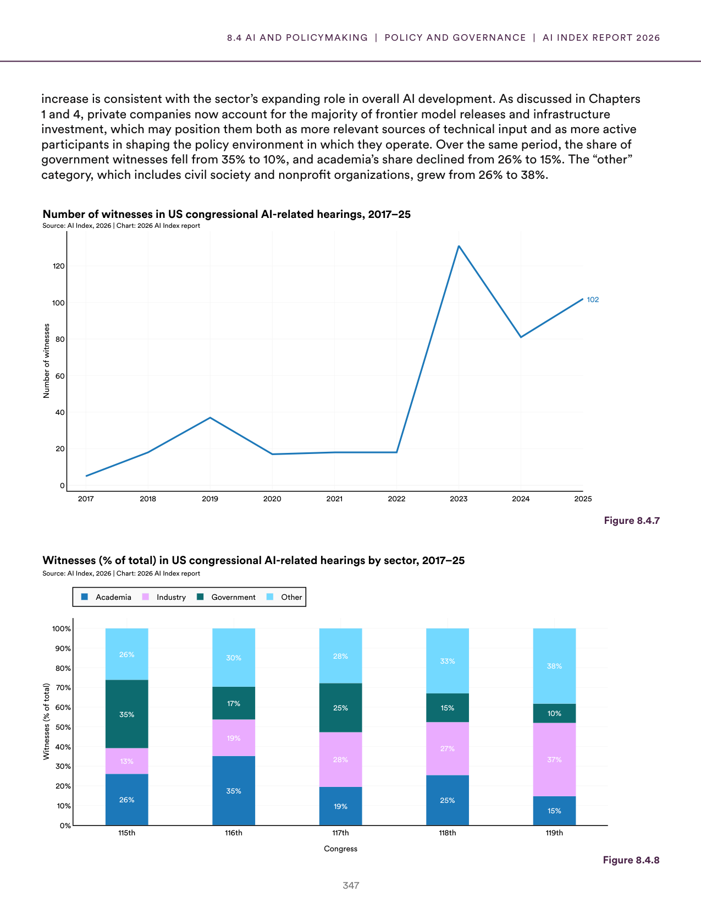
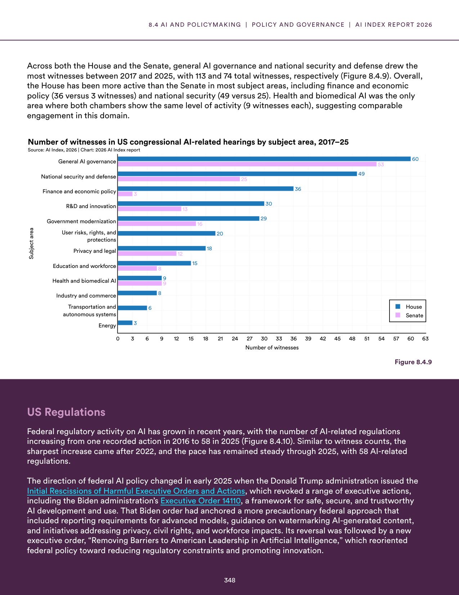
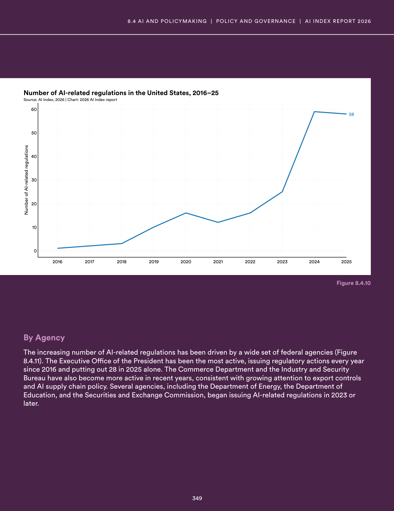
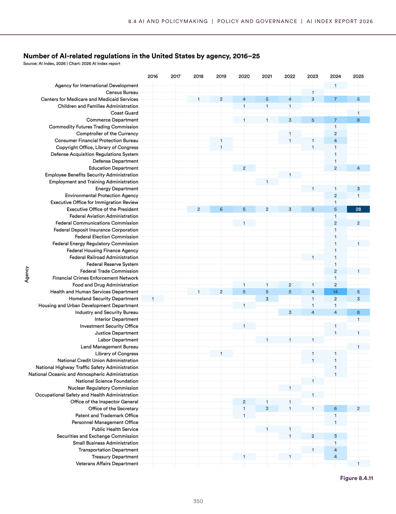
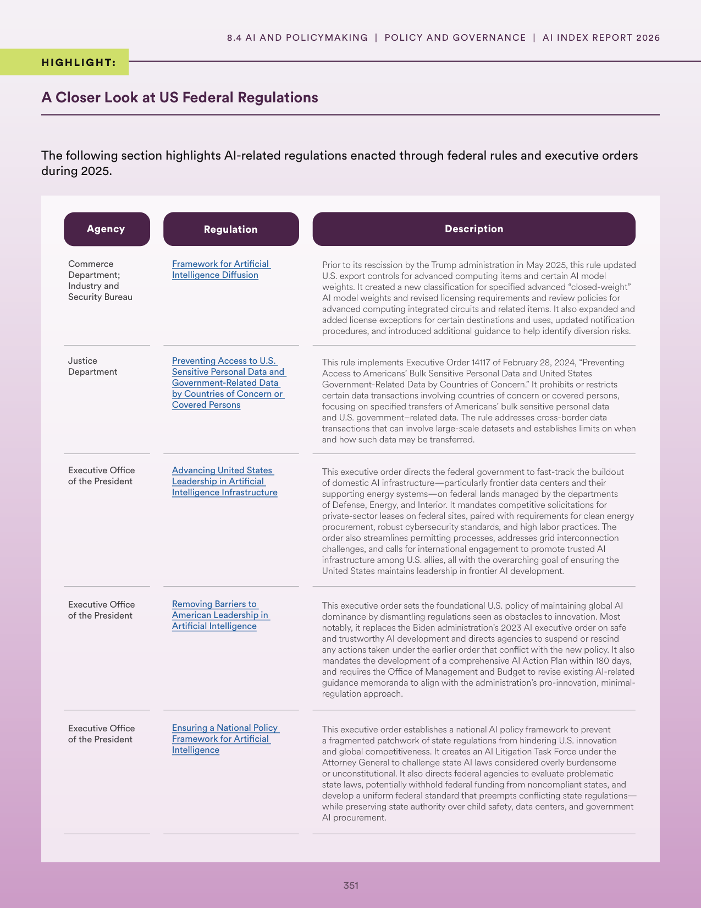
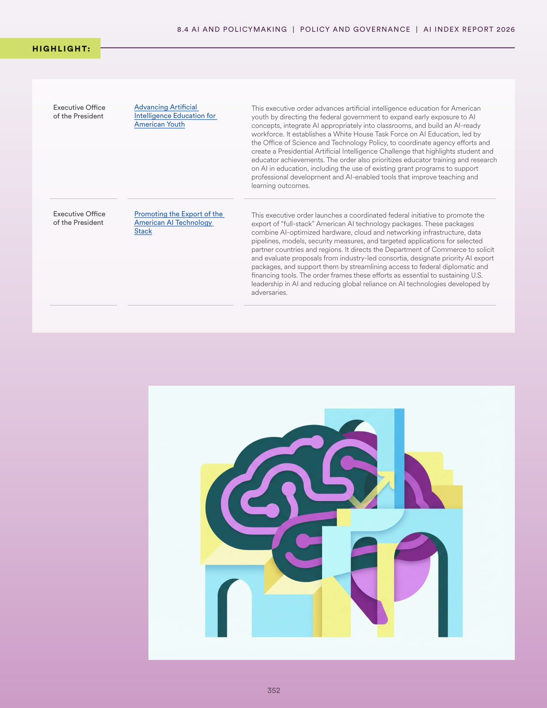

# us_ai_policy_shift.json

**Parent:** [[content/L1/ai-sovereignty-and-us-policy|ai-sovereignty-and-us-policy]] — Countries are pursuing 'Sovereign AI' through GPU clusters and local-language datasets to reduce foreign dependency, while the U.S. government's policy shifted from risk mitigation to a 'pro-innovation' stance between 2020 and 2025 to maintain global leadership.

The provided text details the landscape of U.S. government policy and legislative activity regarding artificial intelligence, specifically focusing on the transition in approach between different administration priorities. Between 2020 and 2025, there was a shift from a focus on safety and risk mitigation to a more aggressive promotion of AI development. A key turning point occurred with the implementation of a new policy framework designed to accelerate AI innovation. This shift is evidenced by the transition from cautious regulatory oversight toward the active removal of barriers to development. Specifically, the text highlights that the U.S. government moved toward a 'pro-innovation' stance, emphasizing the importance of maintaining terms of leadership in AI against global competitors. This transition is reflected in the changing priorities of federal agencies and the types of executive orders issued during this period, which pivoted from managing AI risks to ensuring the United States remains the primary hub for AI research and deployment.

## Source pages

