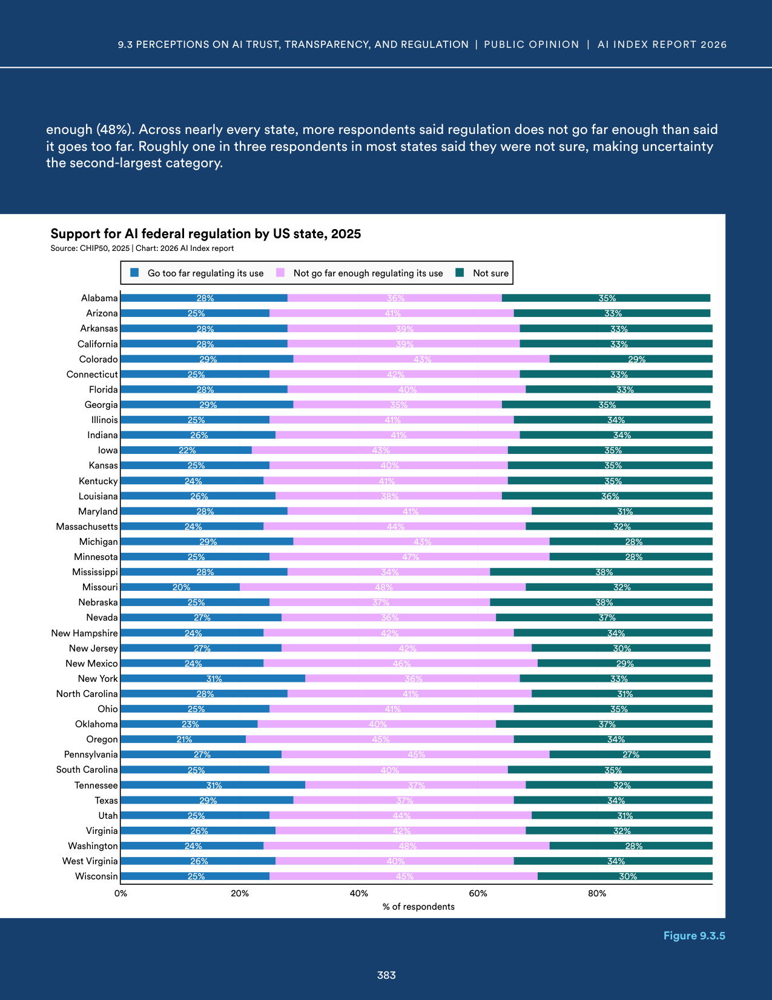
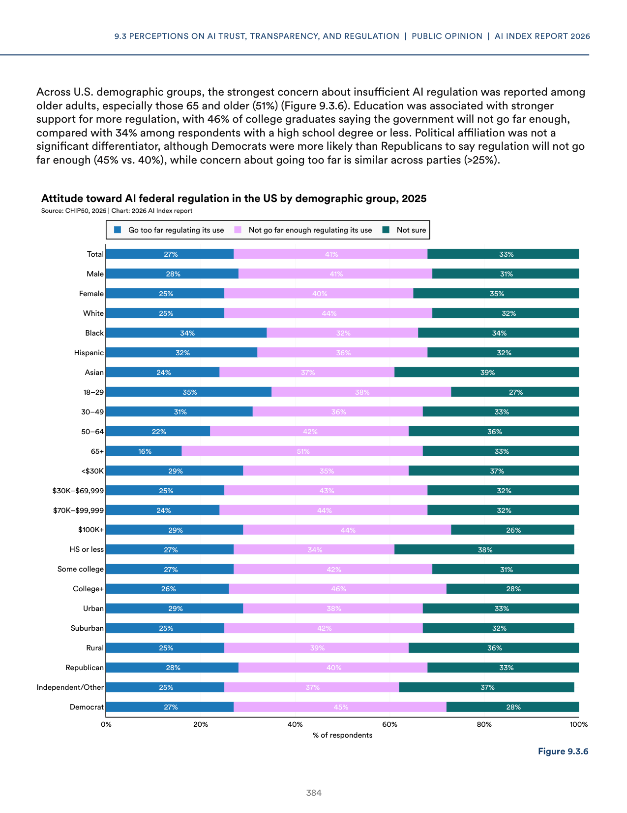

# us_ai_regulation_surveys_2025

**Parent:** [[content/L1/ai-landscape-2025-technical-governance|ai-landscape-2025-technical-governance]] — The 2025 AI landscape is defined by the interplay of high US capital concentration in vertical AI, an increase in RAI framework maturity (from 2.5 to 2.8), and a widespread perception among US demographics (especially older and college-educated individuals) that government regulation is insufficient.

Based on survey data from 2025 regarding AI regulation in the United States, there is a general consensus that current regulatory efforts are insufficient. Across various demographics, users are more likely to believe that the government is not doing enough to regulate AI than to believe it is over-regulating. Specifically, in the case of over-regulation, the percentages are lower across most measured groups. For instance, among those with a college education, there is a higher tendency to view AI regulation as lagging. In terms of political affiliation, Democrats and Republicans both show a lean toward the need for more regulation, though the intensity varies. Age also plays a role, with older populations generally expressing a stronger desire for increased oversight of AI systems.

## Source pages

