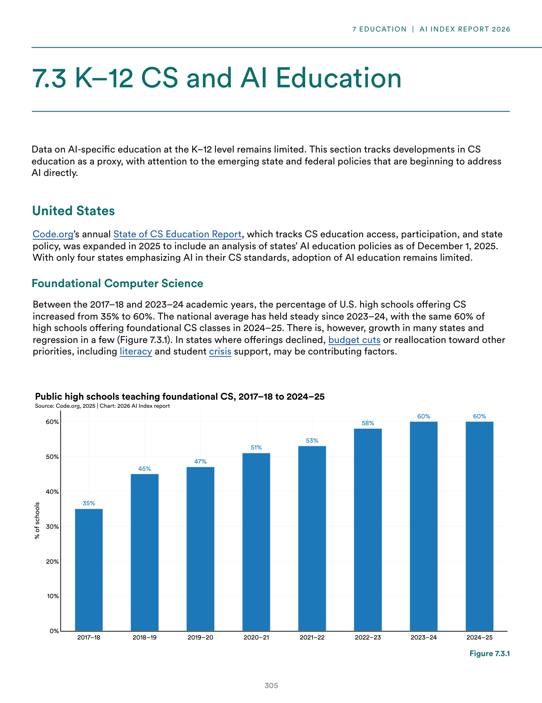
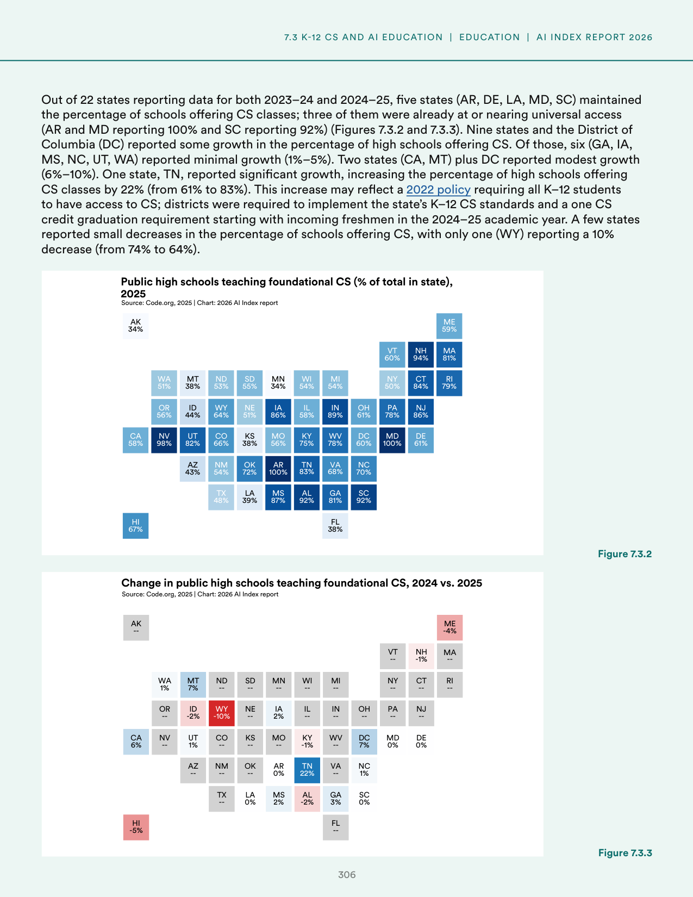
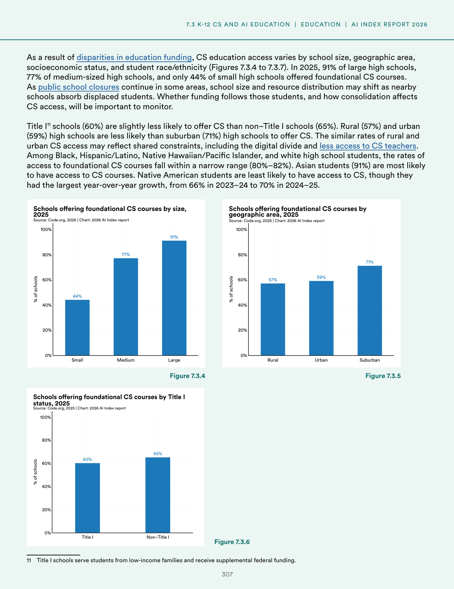
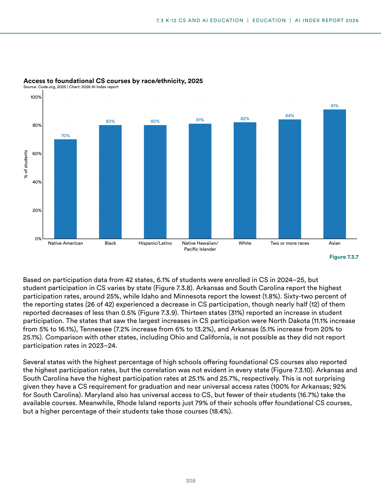
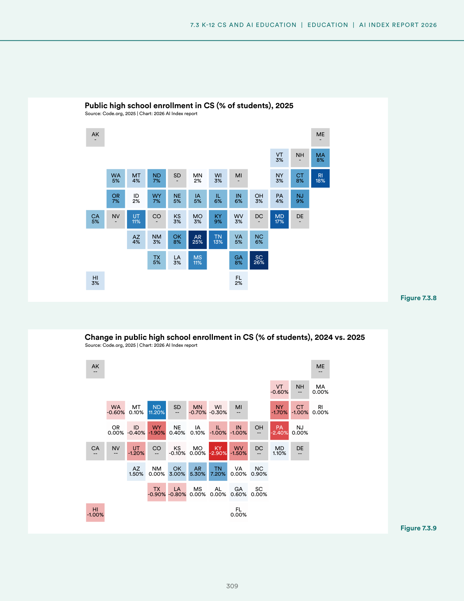
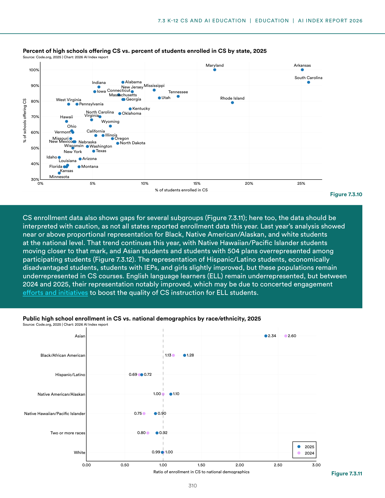
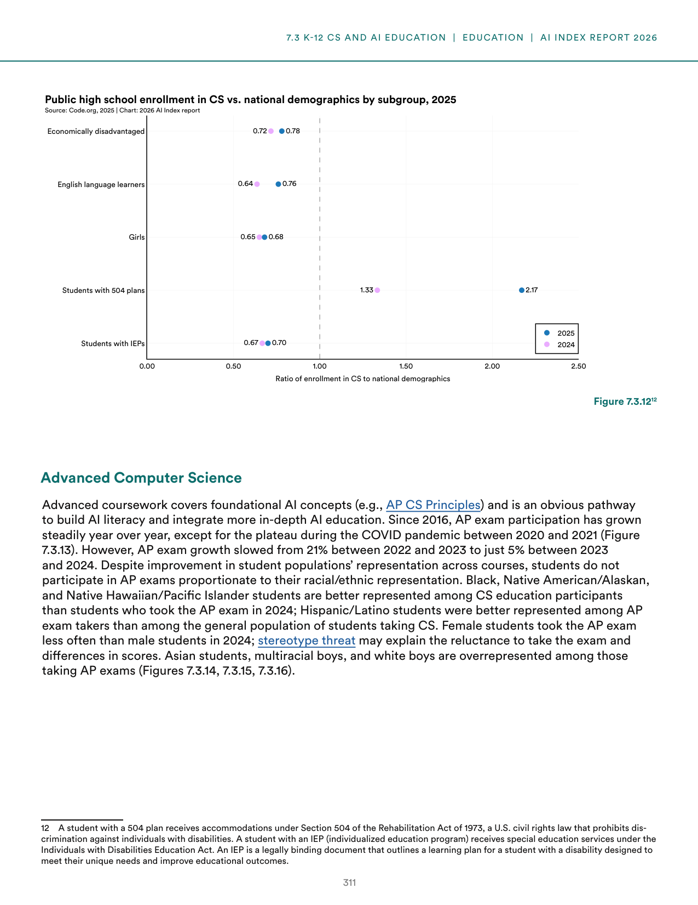
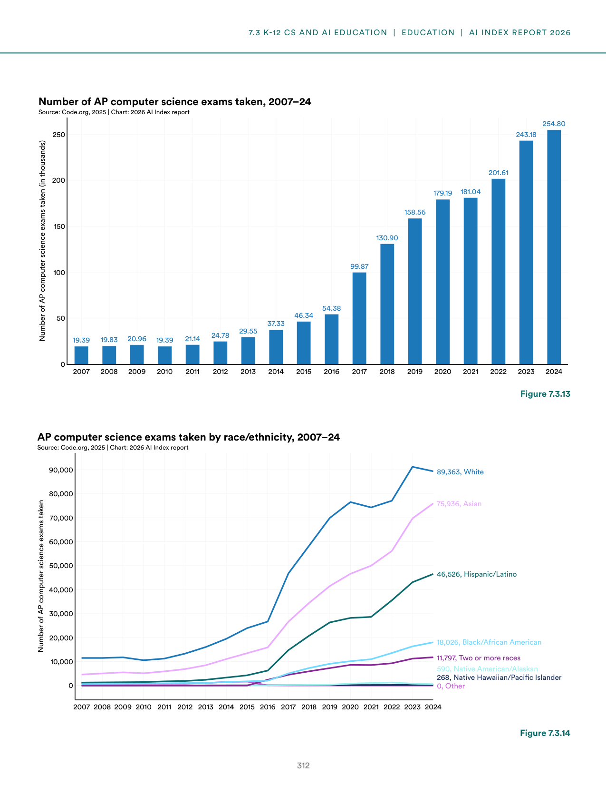

# us_k12_cs_education_trends

**Parent:** [[content/L1/ai-education-ethics-sovereignty-trends|ai-education-ethics-sovereignty-trends]] — The 2025 AI Index reports a global skills gap and a lack of standardized AI curricula, with France, UAE, and China investing billions in 'AI Sovereignty' to reduce NVIDIA and US-provider dependency. In the US, K-12 CS enrollment gaps persist in the U20 population due to teacher shortages, while universities shift from AI bans to guided integration.

According to the 2025 AI Index Report (or associated documentation), the state of K-12 computer science education in the United States shows mixed progress. In terms of access, the percentage of schools offering computer science courses varies, with a notable trend in the growth of these programs. For example, in terms of high school access, the data indicates that while many students have access to computer science, there is a disparity in the quality and availability of these courses across different demographics. 

Specifically, the report highlights that in the U20 population, there is a significant gap in computer science enrollment. For instance, in some regions or demographics, the enrollment rate is significantly lower than in others. Additionally, the report notes that the interest in computer science remains high among students, but the actual enrollment in advanced computer science courses is often hindered by a lack of qualified teachers and systemic barriers. 

Furthermore, the data shows that the demand for computer science education is increasing, with a rise in the number of students taking introductory courses. However, the transition to advanced coursework is a critical bottleneck. The report also mentions that the integration of AI tools into the classroom is beginning to occur, although standardized curricula for AI education are still in development. 

In summary, while the reach of computer science education is expanding, significant challenges remain in ensuring equitable access and providing the necessary instructional support to move students from basic to advanced proficiency.

## Source pages

